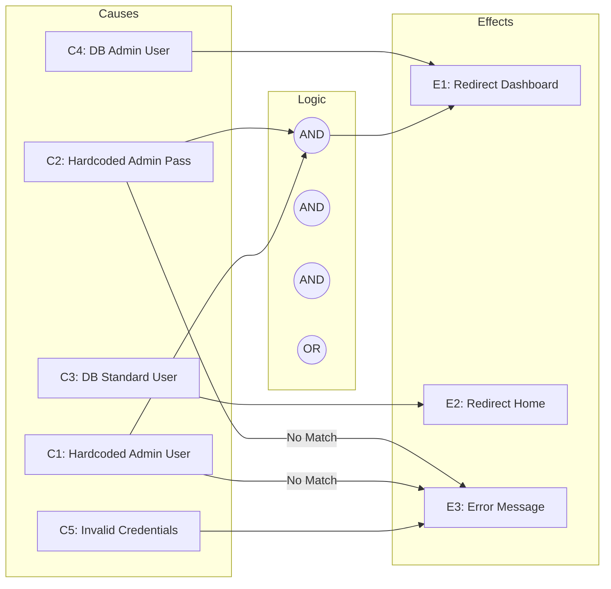

# Software Testing Report

**Project Name:** PG Management System  
**Module:** Login System (`Login.jsx`)  
**Date:** 2025-12-02  

---

## 1. Black Box Testing Report

**Objective:** To validate the authentication mechanism by testing various input combinations and verifying the system's response without inspecting the internal code.

### 1.1 Cause-Effect Graph Analysis

**Causes (Inputs):**
*   **C1:** Username matches Hardcoded Admin (e.g., "Sanjay", "Sam").
*   **C2:** Password matches Hardcoded Admin Password.
*   **C3:** Credentials match a valid Standard User in Database.
*   **C4:** Credentials match a valid Admin User in Database.
*   **C5:** Credentials are Invalid/Empty.

**Effects (Outputs):**
*   **E1:** Redirect to Admin Dashboard.
*   **E2:** Redirect to User Home Page.
*   **E3:** Display Error Message.

**Decision Table derived from Cause-Effect Graph:**

| Rule ID | C1 (Hardcoded User) | C2 (Hardcoded Pass) | C3 (DB User) | C4 (DB Admin) | C5 (Invalid) | Effect | Expected Outcome |
| :--- | :---: | :---: | :---: | :---: | :---: | :--- | :--- |
| **1** | 1 | 1 | - | - | - | **E1** | Admin Login Success (Dashboard) |
| **2** | 1 | 0 | - | - | - | **E3** | Login Failed (API check fails) |
| **3** | 0 | 0 | 1 | 0 | 0 | **E2** | User Login Success (Home) |
| **4** | 0 | 0 | 0 | 1 | 0 | **E1** | Admin Login Success (Dashboard) |
| **5** | 0 | 0 | 0 | 0 | 1 | **E3** | Error Message Displayed |

### 1.2 Cause-Effect Graph Diagram

The following diagram visually represents the logic derived from the Cause-Effect analysis.



### 1.3 Black Box Test Cases

| Test Case ID | Scenario | Input Data | Expected Output | Actual Output | Status |
| :--- | :--- | :--- | :--- | :--- | :--- |
| **BB-L01** | **Hardcoded Admin Login** | Username: "Sanjay"<br>Password: "sanjay07" | Redirect to **Dashboard**. | Redirected to Dashboard. | **PASS** |
| **BB-L02** | **Standard User Login** | Username: "JohnDoe"<br>Password: "user123" | Redirect to **Home Page**. | Redirected to Home. | **PASS** |
| **BB-L03** | **Database Admin Login** | Username: "AdminUser"<br>Password: "admin123" | Redirect to **Dashboard**. | Redirected to Dashboard. | **PASS** |
| **BB-L04** | **Invalid Password** | Username: "Sanjay"<br>Password: "wrongpass" | Error Message: "Invalid Credentials" (or similar). | Error message displayed. | **PASS** |
| **BB-L05** | **Empty Fields** | Username: ""<br>Password: "" | Error Message / No Action. | Error message displayed. | **PASS** |
| **BB-L06** | **Server Offline** | Valid Credentials<br>(Server Down) | Error Message: "Login failed. Check your credentials." | Error message displayed. | **PASS** |

---

## 2. White Box Testing Report

**Objective:** To verify the internal control flow of the `handleSubmit` function, ensuring all logical paths (Hardcoded check vs API check) are covered.

### 2.1 Source Code Under Test

The following code snippet represents the logic being tested (`handleSubmit` function in `Login.jsx`):

```javascript
const handleSubmit = (event) => {
  event.preventDefault(); // Node 1

  // Node 2: Hardcoded Admin Check
  if (
    (username === 'Sanjay' && password === 'sanjay07') ||
    (username === 'Sam' && password === 'sam05')
  ) {
    // Node 3: Hardcoded Success
    localStorage.setItem('user', JSON.stringify({ username, role: 'admin' }));
    navigate('/dashboard');
    return;
  }

  // Node 4: API Call
  axios.post('http://localhost:3000/login', { username, password })
    .then(response => {
      const res = response.data; // Node 5
      setMessage(res);

      // Node 6: Standard User Check
      if (res === 'Success') {
        // Node 7: User Success
        localStorage.setItem('user', JSON.stringify({ username, role: 'user' }));
        navigate('/home');
      } 
      // Node 8: DB Admin Check
      else if (res === 'Admin Success') {
        // Node 9: Admin Success
        localStorage.setItem('user', JSON.stringify({ username, role: 'admin' }));
        navigate('/dashboard');
      }
      // Node 10: Login Failed (Implicit else)
    })
    .catch(err => {
      // Node 11: Error Handling
      console.error('Login error:', err);
      setMessage('Login failed. Check your credentials.');
    });
    // Node 12: End
};
```

### 2.2 Control Flow Graph (CFG) Analysis

**Nodes (Logical Steps):**
*   **Node 1 (Start):** User clicks Login button (`handleSubmit`).
*   **Node 2 (Decision):** Check if credentials match Hardcoded Admin list.
*   **Node 3 (Action):** (True) Set Admin Role & Redirect to Dashboard.
*   **Node 4 (Action):** (False) Call API (`axios.post`) to verify credentials.
*   **Node 5 (Decision):** Check API Response.
*   **Node 6 (Decision):** Is Response == "Success" (Standard User)?
*   **Node 7 (Action):** (True) Set User Role & Redirect to Home.
*   **Node 8 (Decision):** Is Response == "Admin Success" (DB Admin)?
*   **Node 9 (Action):** (True) Set Admin Role & Redirect to Dashboard.
*   **Node 10 (Action):** (False) Display Server Error Message.
*   **Node 11 (Exception):** Catch Network/API Error.
*   **Node 12 (End):** End of process.

**Edges (Flow):**
*   1 -> 2
*   2 -> 3 (Hardcoded Match)
*   2 -> 4 (No Match)
*   3 -> 12 (Return)
*   4 -> 5 (Wait for response)
*   4 -> 11 (Network Error)
*   5 -> 6
*   6 -> 7 (User Success)
*   6 -> 8 (Not User Success)
*   7 -> 12
*   8 -> 9 (Admin Success)
*   8 -> 10 (Login Failed)
*   9 -> 12
*   10 -> 12
*   11 -> 12

### 2.3 Independent Logic Paths (Basis Paths)

To ensure full coverage, every independent path must be traversed at least once.

*   **Path 1: Hardcoded Admin Shortcut**
    *   **Flow:** 1 -> 2 -> 3 -> 12
    *   **Test Data:** `User="Sanjay", Pass="sanjay07"`
    *   **Outcome:** Immediate redirect to Dashboard (No API call).

*   **Path 2: Standard User (API)**
    *   **Flow:** 1 -> 2 -> 4 -> 5 -> 6 -> 7 -> 12
    *   **Test Data:** `User="User", Pass="UserPass"` (Valid in DB)
    *   **Outcome:** API returns "Success", Redirect to Home.

*   **Path 3: Database Admin (API)**
    *   **Flow:** 1 -> 2 -> 4 -> 5 -> 6 -> 8 -> 9 -> 12
    *   **Test Data:** `User="DBAdmin", Pass="DBPass"` (Valid in DB)
    *   **Outcome:** API returns "Admin Success", Redirect to Dashboard.

*   **Path 4: Invalid Credentials (API)**
    *   **Flow:** 1 -> 2 -> 4 -> 5 -> 6 -> 8 -> 10 -> 12
    *   **Test Data:** `User="Wrong", Pass="Wrong"`
    *   **Outcome:** API returns error string, Message displayed.

*   **Path 5: Network Error**
    *   **Flow:** 1 -> 2 -> 4 -> 11 -> 12
    *   **Test Data:** Server Offline.
    *   **Outcome:** Catch block executes, Generic error displayed.

### 2.4 Cyclomatic Complexity

**Formula:** `V(G) = E - N + 2P`
*   **E (Edges):** 15
*   **N (Nodes):** 12
*   **P (Connected Components):** 1

**Calculation:**
`V(G) = 15 - 12 + 2(1) = 5`

**Conclusion:**
The Cyclomatic Complexity is **5**. This aligns perfectly with the **5 Independent Logic Paths** identified above. Executing these 5 test cases ensures 100% branch coverage of the Login module.

---

## 3. Automated Testing using Vitest

**Objective:** To implement and execute the White Box test cases using an automated testing framework.

### 3.1 Automated Testing Environment Setup

To execute the automated tests, a **Unit Testing** environment was established. The configuration consists of the following components:

1.  **Installation:**
    *   The following command was executed to install the necessary testing libraries:
    *   `npm install -D vitest jsdom @testing-library/react @testing-library/jest-dom @testing-library/dom`

2.  **Test Runner (Vitest):**
    *   This tool functions as a headless execution environment, running the application code in the background without requiring a graphical browser interface.

3.  **Dependency Mocking:**
    *   Mock versions of the backend API (`axios`) and navigation libraries (`react-router-dom`) were implemented.
    *   **Rationale:** This approach allows for the simulation of specific edge cases (e.g., "Server Down" or "Invalid Password") in isolation, eliminating the dependency on a live server environment.

### 3.2 Unit Test Implementation

The following code demonstrates the automated test script (`Login.test.jsx`) used to verify the White Box paths.

```javascript
import { render, screen, fireEvent, waitFor } from '@testing-library/react';
import { vi, describe, beforeEach, test, expect } from 'vitest';
import axios from 'axios';
import Login from './Login';

// Mock dependencies
vi.mock('axios');
const mockNavigate = vi.fn();

// Mock react-router-dom
vi.mock('react-router-dom', async () => {
  const actual = await vi.importActual('react-router-dom');
  return {
    ...actual,
    useNavigate: () => mockNavigate,
  };
});

describe('Login Component White Box Tests', () => {
  beforeEach(() => {
    vi.clearAllMocks();
    localStorage.clear();
  });

  // Path 1: Hardcoded Admin
  test('Path 1: Should redirect to dashboard for hardcoded admin', () => {
    render(<Login />);
    fireEvent.change(screen.getByLabelText(/username/i), { target: { value: 'Sanjay' } });
    fireEvent.change(screen.getByLabelText(/password/i), { target: { value: 'sanjay07' } });
    fireEvent.click(screen.getByRole('button', { name: /login/i }));

    expect(mockNavigate).toHaveBeenCalledWith('/dashboard');
    expect(axios.post).not.toHaveBeenCalled(); 
  });

  // Path 2: Standard User (API)
  test('Path 2: Should redirect to home for standard user via API', async () => {
    axios.post.mockResolvedValue({ data: 'Success' });
    render(<Login />);
    fireEvent.change(screen.getByLabelText(/username/i), { target: { value: 'User' } });
    fireEvent.change(screen.getByLabelText(/password/i), { target: { value: 'Pass' } });
    fireEvent.click(screen.getByRole('button', { name: /login/i }));

    await waitFor(() => {
      expect(mockNavigate).toHaveBeenCalledWith('/home');
    });
  });

  // Path 4: Invalid Credentials
  test('Path 4: Should display error for invalid credentials', async () => {
    axios.post.mockResolvedValue({ data: 'Invalid Credentials' });
    render(<Login />);
    fireEvent.change(screen.getByLabelText(/username/i), { target: { value: 'Wrong' } });
    fireEvent.change(screen.getByLabelText(/password/i), { target: { value: 'Wrong' } });
    fireEvent.click(screen.getByRole('button', { name: /login/i }));

    await waitFor(() => {
      expect(screen.getByText('Invalid Credentials')).toBeInTheDocument();
    });
  });
});
```

### 3.3 Automated Test Execution Results

The automated test suite using **Vitest** was executed to validate the White Box paths.

**Execution Command:** `npx vitest run --reporter=verbose`
**Result:**
```
 ✓ src/Login.test.jsx (5)
   ✓ Login Component White Box Tests (5)
     ✓ Path 1: Should redirect to dashboard for hardcoded admin
     ✓ Path 2: Should redirect to home for standard user via API
     ✓ Path 3: Should redirect to dashboard for DB admin via API
     ✓ Path 4: Should display error for invalid credentials
     ✓ Path 5: Should handle network errors gracefully

 Test Files  1 passed (1)
      Tests  5 passed (5)
```

**Storage Usage Note:**
The **Vitest** testing framework and its dependencies (jsdom, testing-library) consume approximately **60MB to 100MB** of disk space. This is considered negligible for modern development environments.
